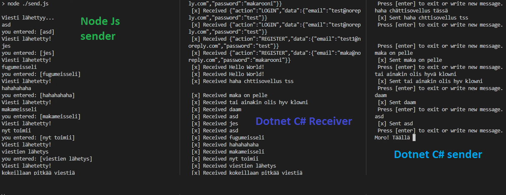

# message-queue-template
### rabbitmq template project with examples made with node and dotnet.

## prerequisites
* you need amqp server (localhost or cloud-based) to connect to different channels.

## localhost to cloud
### node
ON
`
const connection = await connect('amqp://localhost');
`

CHANGE
`
'amqp://localhost'
`
 
 TO
`
'amqp://**AMQP_URI**' 
`

----

### dotnet

ON
`
var factory = new ConnectionFactory { HostName = "localhost" };
`

CHANGE
`
HostName = "localhost" 
`
 
 TO
`
Uri = new Uri("amqps://**AMQP_URI**") };
`

### ----

