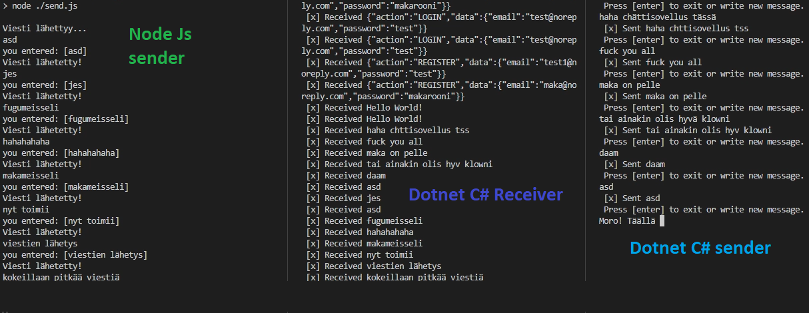

# message-queue-template
### rabbitmq template project with examples made with node and dotnet.

## prerequisites
* you need amqp server (localhost or cloud-based) to connect to different channels.

### ----

